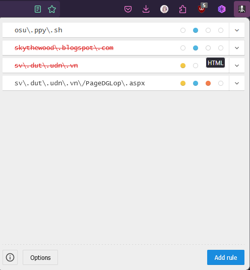
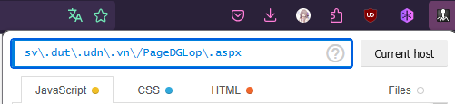
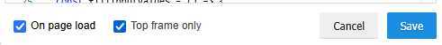
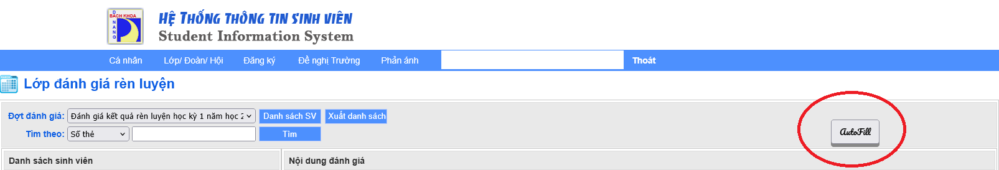

# Cài đặt Autofill cho Đánh giá rèn luyện - Dành cho lớp trưởng

1. Cài đặt Code Injector cho trình duyệt của bạn tại [Code Injector](https://github.com/Lor-Saba/Code-Injector)
2. Sau khi cài đặt xong và mở lên sẽ có giao diện như trên hình:
   
3. Chọn Add rule và thêm đoạn regex tương ứng với url ĐGRL lớp `sv\.dut\.udn\.vn\/PageDGLop\.aspx ` vào ô:
   
4. Add các đoạn mã tương ứng:

- `index.js` vào mục JavaScript

```js
   // Constants
   const BUTTON_ID = "ResolvedAutoButton";
   const MIN_COUNT = 10;
   const MAX_COUNT = 160;
   const STEP = 10;

   // Generate array of counts (10, 20, 30, ..., 150)
   const counts = Array.from(
       { length: (MAX_COUNT - MIN_COUNT) / STEP + 1 },
       (_, i) => MIN_COUNT + i * STEP
   );

   // Selector functions
   const getTableCellSelector = (count) => {
       const paddedCount = count < 100 ? `0${count}` : count;
       return `tr#chcn21CH${paddedCount} td:nth-child(4)`;
   };

   const getInputSelector = (count) => {
       const paddedCount = count < 100 ? `0${count}` : count;
       return `#DGRLtxt21CH${paddedCount}`;
   };

   // Main functionality
   const fillInputValues = () => {
       console.log('filling...');

       counts.forEach((count, index) => {
           const cell = document.querySelector(getTableCellSelector(count));
           const input = document.querySelector(getInputSelector(count));

           if (cell && input) {
               input.value = cell.innerText || 0;
           }

           // Focus and blur the last input to trigger any necessary events
           if (index === counts.length - 1) {
               console.log('done');
               input.focus();
               input.blur();
           }
       });
   };

   // Event listener
   document.getElementById(BUTTON_ID).addEventListener("click", fillInputValues);
```

- `index.css` vào mục CSS

```css
       @import url('https://fonts.googleapis.com/css2?family=Pacifico&display=swap');
       .button-res{
           width: fit-content;
           height: fit-content;
           padding: 0.5rem 1rem;
           font-weight: bold;
           box-shadow: 0px 5px #888888;
       }
       .resolved-flex{
           position: absolute;
           top: 16rem;
           right: 16rem;
           display: flex;
           flex-direction: row;
           column-gap: 1rem;
       }
       .pacifico-regular {
       font-family: "Pacifico", serif;
       font-weight: 400;
       font-style: normal;
       }
```

- `index.html` vào mục HTML

```html
       <div class="resolved-flex">
           <button id="ResolvedAutoButton" class="button-res pacifico-regular">
               AutoFill
           </button>
       </div>
```

5. Chắc chắn rằng "On page load" và "Top frame only" đã được tick
   
6. Truy cập `http://sv.dut.udn.vn/PageCaNhan.aspx` hoặc reload nếu đang ở trang, sẽ thấy 1 button nhỏ nhỏ "Autofill" bên phải như trong hình
   
7. Load 1 bạn bất kì và ấn "Autofill", dữ liệu sẽ được lấy dựa theo điểm rèn luyện đã đánh giá của các bạn đó. Từ đây bạn có thể tùy chỉnh điểm số hoặc spam "Lưu" mà đỡ tốn thêm thời gian nhập điểm lại từ đầu tới cuối :D

## Note

- Bạn có thể dùng những code injector khác, miễn là nó có hỗ trợ
- Đoạn code CSS mình có thêm mấy cái style "Hoa mỹ" khác không có liên quan nhiều nên mấy bạn có thế bỏ cũng đc :D

---

### Thanks for reading
